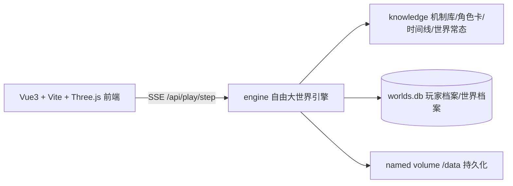

# 新三国 · 星空 —— 天意星球

> 一个由蹩脚 AI 生成的三国世界。天意是被污染的游戏管理员，你是偶然落入此世的穿越者。
> 你知道历史的大概走向——但这个世界把每一个字都写错了。

---

## 这是什么

以 2010 版电视剧《新三国》的荒诞世界观为底子构建的**克苏鲁式元叙事互动游戏**。核心设定一句话：

> **天意 = 崩溃的游戏管理员系统。** 它钉死历史关键节点，用“脚本修正”强行把剧情扳回正轨；角色会在关键节点被系统接管，说出前言不搭后语的话——而他们自己毫无察觉。只有玩家知道：历史大势不可改，但过程可以；修正必留痕，人心可改变。

### 铁律（世界观基石）

1. **世界侧零提示**——NPC 与旁白绝不出现“系统/AI/游戏”等 meta 语言，世界漏洞只经玩家视角呈现；
2. **历史大势不可推翻**——天意修正，但留痕且过程可被改写；
3. **玩家的关系、声望、记忆永远生效**——修正只改事件，不改人心；
4. **无失败，只有后果**——错过名场面得简报，莽撞行事付代价，死亡读档最近快照。

---

## 产品结构（三代同堂）

| 产品 | 入口 | 形态 | 状态 |
|------|------|------|------|
| **星图**（世界观可视化） | 首页 | 9 套世界观框架 × 111 条机制，3D 力导向图 + 节点深潜 | ✅ 在线 |
| **新三国星空**（主力） | 天意主星 | 自由沙盒：46 场景名场面 + 21 地点 + 48 历史事件，LangGraph 引擎 | ✅ 在线 |
| 崩坏纪元（旧叙事线） | — | 原剧本改编，已下线归档（backend/game_world/） | 🗄 归档 |

### 天意机制体系（示例）

| 机制 | 含义 |
|------|------|
| A1-04 天意全能 | 扭转因果、修正现实、侵蚀心智 |
| A1-05 天意必成 | 天意让一件事成，就一定成 |
| A1-06 窥探天意 | 少数人可窥（曹操/刘备/司马懿），但必遭侵蚀 |
| A1-07 天意侵蚀 | 运气-90%、智力-90%、野心+100%、衰老+250% |
| A1-09 关羽之歌 | 全剧 63 次——它一响，天意在存档/结算 |
| A4-02 酒规则 | 酒是至高存在，可暂免天意侵蚀 |

---

## 架构

生成流水线：**director**（确定性选场景）→ **narrate**（LLM 叙事）→ **validate**（8-PHASE 硬校验，失败重写 ≤2）→ **corrector**（天意修正，按干预度三档）→ **remember**（STM/LTM/PIN 记忆 + 状态合并）→ **世界推进**（按行动耗时推日期、事件到点触发、历史压缩跳时）。



---

## 目录结构

```
new-three/
├── backend/                  # FastAPI 后端
│   ├── engine/               #   自由大世界引擎（LangGraph）
│   │   └── scenes/registry.json   # 46 个名场面内容包
│   ├── game_world/           #   旧叙事引擎（归档）
│   ├── knowledge/            #   机制库/角色卡/时间线/世界常态
│   ├── routers/ services/    #   API 路由与 LLM 服务
│   └── scripts/              #   数据管线与冒烟测试
├── frontend/                 # Vue3 + Vite 前端
│   ├── src/pages/            #   LandingPage/PlayPage/ExplorePage…
│   ├── src/components/       #   24 个组件（叙事流/面板/粒子/氛围）
│   └── public/               #   纹理/静态资源
├── docs/                     # 设计与协议文档（13 篇）
│   └── scenes/               #   45 篇场景设计稿（五步协议）
├── design-system/            # 设计系统 MASTER
├── materials/                # 素材库（折棒 289 期吐槽 + 字幕台词）
├── deploy/                   # 生产部署配置（腾讯云/Cloudflare）
├── Dockerfile · docker-compose.yml · entrypoint.sh · nginx.conf
└── README.md
```

---

## 快速开始（本地开发）

```bash
# 后端（需 Python 3.12+，见 backend/requirements.txt）
cd backend
pip install -r requirements.txt
python main.py               # uvicorn :8000（reload）

# 前端（Node 20+）
cd frontend
npm install
npm run dev                  # vite :5173（/api 代理到 :8000）
```

> **BYOK**：玩家在星图「设置」星球填入自己的 DeepSeek API Key（存浏览器本地），服务端不兜底。后端 .env 可配 DEEPSEEK_API_KEY / HY3_API_KEY 作备用。

### 测试

```bash
cd backend
python scripts/test_world_flow.py   # 自由大世界全链路冒烟（56/57，1 项需真实 Key）
```

---

## 部署

| 场景 | 方式 | 说明 |
|------|------|------|
| 生产（腾讯云） | Docker Compose | 多阶段构建（node 20 + python 3.12 + nginx），named volume 持久化存档，健康检查+优雅停机，见 deploy/README.md |
| 备案期（Cloudflare） | Pages + Tunnel | 前端 Cloudflare Pages（Git 自动构建），API 经命名隧道回源，源站零公网端口 |
| 恢复国内直连 | 还原 nginx 配置 | deploy/nginx.closed.conf 反向操作，见 deploy/README.md |

---

## 文档索引

| 文档 | 内容 |
|------|------|
| [产品需求文档](docs/产品需求文档.md) | 初版 PRD（星图解读器） |
| [剧情骨架](docs/剧情骨架.md) | 8 篇章总览 + 世界观提示词体系 |
| [自由沙盒重构设计](docs/自由沙盒重构设计.md) | 现行架构：事件驱动活世界 |
| [引擎设计规范](docs/引擎设计规范.md) | LangGraph 管线与校验规范 |
| [互动叙事引擎规范](docs/互动叙事引擎规范.md) | 8-PHASE 校验流水线 |
| [场景开发协议](docs/场景开发协议.md) | 五步流程 + 文风七要素 |
| [docs/scenes/](docs/scenes/) | 45 篇场景设计稿 |

---

## 素材与致谢

- 世界观机制源自 B 站 UP 主**吃蛋挞的折棒**《三国杀 up 锐评新三国》系列（289 期 + re 系列），字幕与吐槽素材见 materials/；
- 场景锁定台词以朱苏进版《三国》剧本字幕为锚（见 materials/script_ocr/）；
- 历史时间线共 48 事件，均以 historical_outcome + new_three_quirks 双字段自标注剧版与史实差异。

> 私有仓库 · 非商业项目 · 仅供学习交流